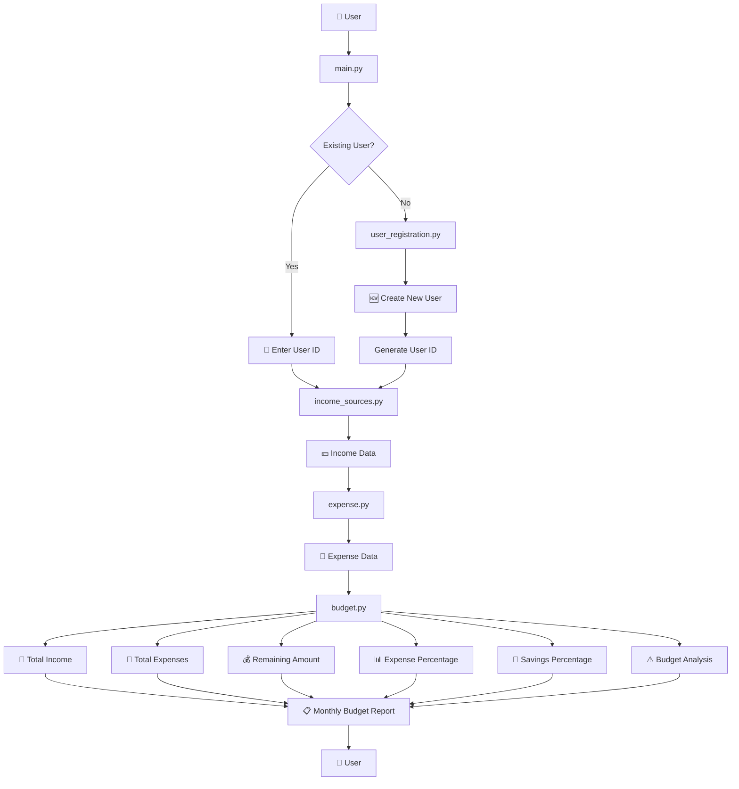

<div align="center">

#   Personal Budgeting Tool
<h2>
 Python Based Budgeting Tool
 </h2>
</div>

> A simple Python-based budgeting application that helps users maintain and track their monthly income and expenses, calculate their remaining amount, and analyse their savings.

---

## 🌟 About the Project

**Personal Budgeting Tool** is a beginner-friendly Python project created to understand how a real-world application can be divided into multiple modules and connected together.

The project allows a user to:

- 👤 Register as a new user
- 🔑 Use an existing user ID
- 💵 Add multiple income sources
- 💸 Add multiple expenses
- 🧮 Calculate total monthly income
- 📊 Calculate total monthly expenses
- 💰 Calculate the remaining amount
- 📈 Calculate expense and savings percentages
- 🎯 Check the savings target
- ⚠️ Detect when expenses exceed income
- 📝 Generate a basic monthly budget report
- 📝 Give advices on budget

The project uses JSON files for storing user data.It stores registered user"s user id, income,expense.

The project is currently a **command-line application** and is being developed incrementally as I learn Python.

---

## 🎯 Project Goal

The main goal of this project is to help users manage their expenses and create a budget for themselves.


It is also a learning project through which I am practising:

- Python programming
- Functions
- Modules
- Dictionaries
- Lists
- Loops
- Conditional statements
- JSON data storage
- File handling
- User input
- Data processing
- Basic financial calculations
- Project structure
- Git & GitHub

---

# ✨ Features

| Feature | Description |
|---|---|
| 👤 User Registration | Creates a new user and generates a unique user ID |
| 🔑 Existing User | Allows previously registered users to access their data |
| 💵 Income Management | Stores multiple income sources |
| 💸 Expense Management | Stores different expenses |
| 🧮 Income Calculation | Calculates total monthly income |
| 📊 Expense Calculation | Calculates total monthly expenses |
| 💰 Remaining Amount | Calculates income minus expenses |
| 📈 Expense Analysis | Calculates expenses as a percentage of income |
| 💾 Savings Analysis | Calculates the percentage of income remaining |
| 🎯 Savings Target | Compares savings with the project's 25% target |
| ⚠️ Budget Warning | Detects when expenses exceed income |
| 📋 Budget Report | Displays a monthly budget summary |

---

# 🔍 System Overview

The application is divided into separate Python modules.


---
## 🏗️ Project Architecture
```text
Personal Budgeting Tool/
│
├── 📂 src/
│   │
│   ├── 🐍 main.py
│   ├── 👤 user_registration.py
│   ├── 💵 income_sources.py
│   ├── 💸 expense.py
│   ├── 📊 budget.py
│   ├── ⚙️ options.py
│   │
│   └── 📄 user_data.json
│
├── 📄 README.md
├── 📄 LICENSE
├── 📄 .gitignore
└── 📄 .gitattributes
```
## 🧠 Python Concepts Used

This project helped me apply and understand several core Python concepts through a practical budgeting application.

- 🐍 **Variables and Data Types**
- 🔤 **String Manipulation**
- ⌨️ **User Input and Output**
- 🔀 **Conditional Statements (`if`, `elif`, `else`)**
- 🔁 **Loops (`for`, `while`)**
- 🧩 **Functions and Return Values**
- 📦 **Modules and Imports**
- 🗂️ **Dictionaries**
- 📋 **Lists**
- 🔑 **Dictionary Methods (`.items()`, `.values()`, `.update()`)**
- 🎯 **`match-case` Statements**
- 📄 **File Handling**
- 💾 **JSON Data Storage and Retrieval**
- 🧮 **Arithmetic Operations and Calculations**
- 🔗 **Passing Arguments Between Functions**
- 🧱 **Modular Programming**
- 🛠️ **Error Handling and Input Validation**
- 📁 **Project Structure and File Organization**
---

## 💻 How To Run
### Prerequisites--->
1. Make sure you have Python 3.10+
2. Github and Git installed
3. A code editor such as VS Code
---
### Follow these steps to run the Personal Budgeting Tool.
---

#### 1. Clone the Repository
```text
git clone https://github.com/Ayushmaan1304-coder/Personal-Budgeting-Tool.git
```
#### 2. Open the Project Folder
```
cd Personal Budgeting Tool
```
#### 4. Run the Program
Run the main Python file:
```
python main.py
```
## 🚀 Future Enhancements

- 📊 Add graphs and visualizations for income, expenses, and savings.
- 📅 Introduce monthly and historical budget tracking.
- 🎯 Add financial goals and progress tracking.
- 💡 Provide smarter, personalized budgeting recommendations.
- 🔐 Improve authentication and data security.
- 🗄️ Replace JSON storage with a database such as SQLite.
- 🖥️ Develop a graphical user interface (GUI).
- 🤖 Integrate AI for intelligent financial insights.
- 📄 Add PDF/CSV financial report generation.
- ☁️ Explore cloud storage and web/mobile versions.

# Author
**Ayushmaan Trivedi**


